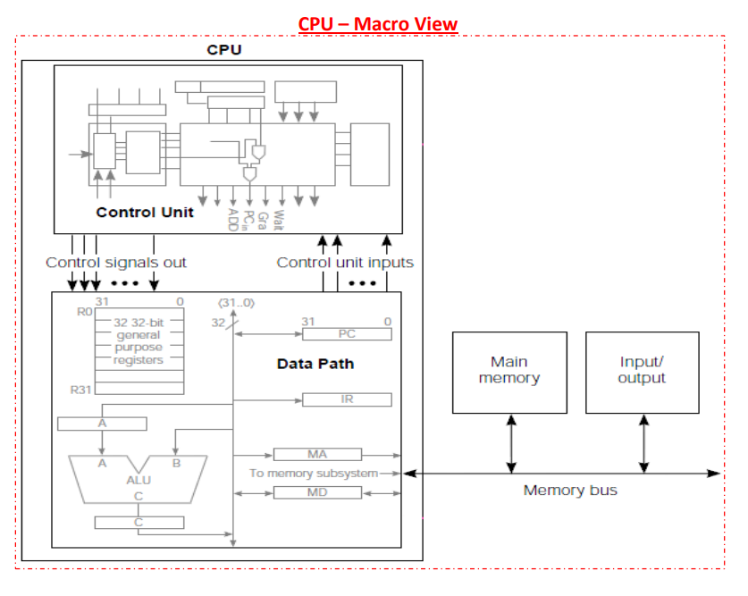
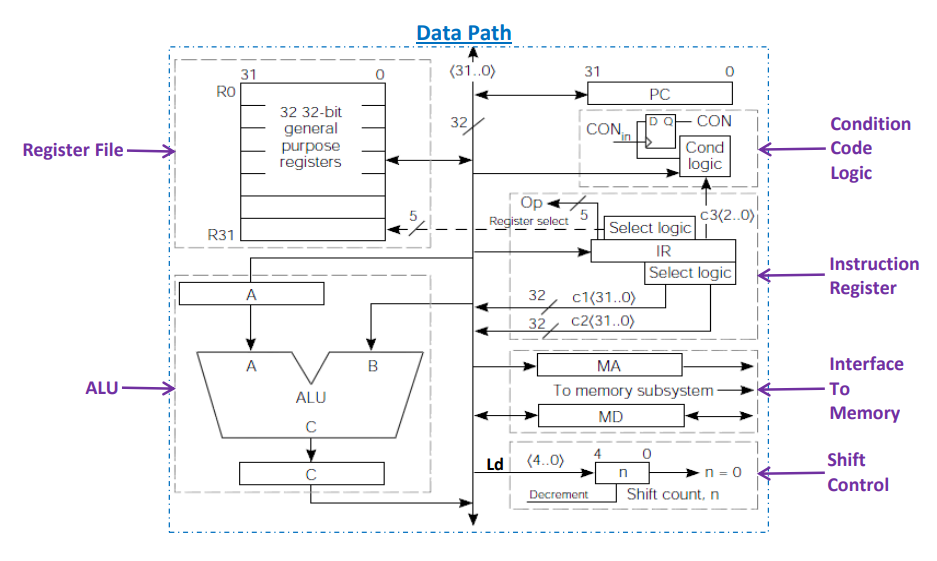
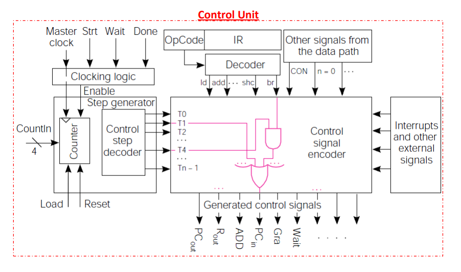
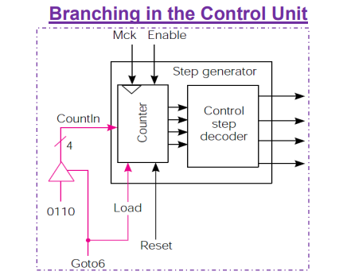
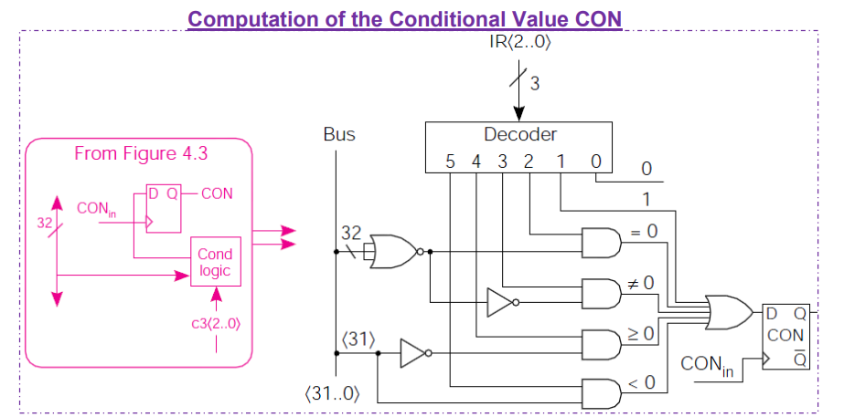
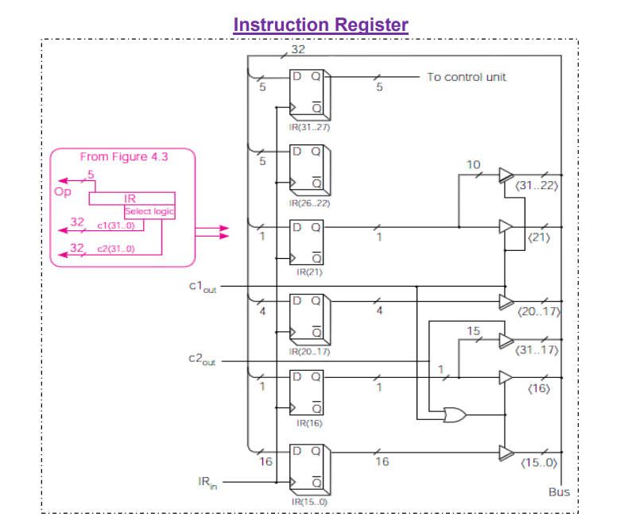
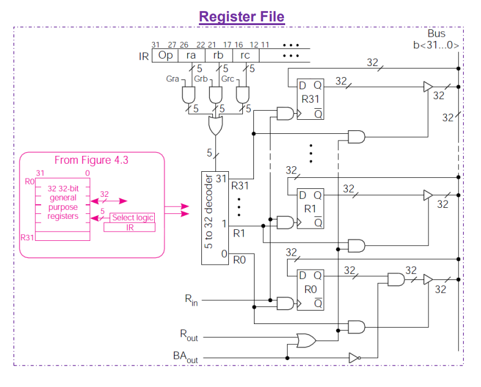
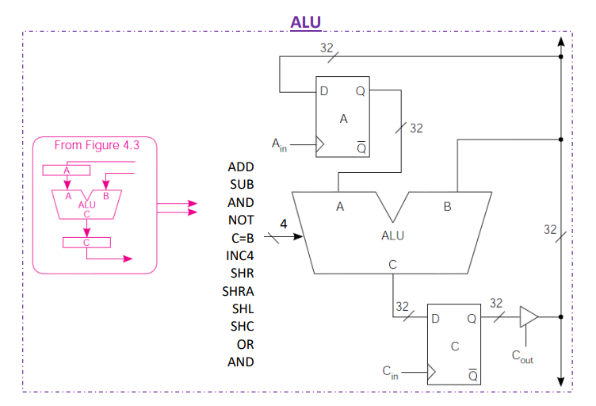
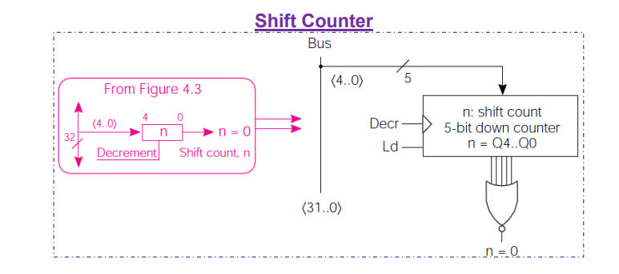
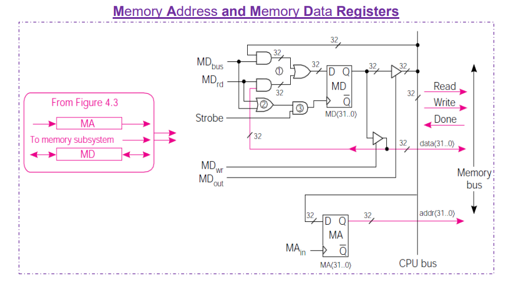

#  Simple RISC-V Processor


Developed by Roei Sabag and Matan Izraeli  

Educational RISC-V based processor implemented in SystemVerilog and simulated using Vivado with a custom Python assembler.


---


##  Overview

This project implements a simple 32-bit RISC-V compatible processor, designed for learning and experimentation.  

It can be fully simulated in Vivado without requiring real FPGA hardware.  

The system loads instructions from a HEX file into memory unit and executes them step-by-step through a modular architecture.

note* - the memory module includes a parameter named initfile, which defines the path to the program file (in HEX format) this file is used to initialize the memory contents during simulation or synthesis.

Special thanks to Hanan Ribo for providing the cpu block diagram used in this project.


---


##  System Specifications   

| Parameter | Description |

|-------------|-------------|

| BUS Width   |  32 bits    |

| Memory Size | 1024 words  |

| Instruction Count | 22 supported instructions |

| Program Loading   | From `.hex` file into memory during simulation |


---


##  Project Structure

```
simple_riscV.srcs/
│
├── rtl
│   ├── SRC_top.sv
│   ├── ALU.sv
│   ├── IR.sv
│   ├── PC_u.sv
│   ├── alu_op.sv
│   ├── clocking_logic.sv
│   ├── con_u.sv
│   ├── control_u.sv
│   ├── memory.sv
│   ├── opCodesPkg.sv
│   ├── register_file.sv
│   └── shift_control.sv
│
├── tb
│   ├── imports/new/
│   └── new
│	     └── tb_SRC.sv
│
├── python_tools
│   └── assembler.py
│
├── program_init
│   └── program.hex
│
└── docs
    ├── cpu_block_diagram
    ├── RTL_Schematic
    ├── waveform_output
    ├── vivado_synthesis_report
    └── instruction_set_table
```


##  Architecture Overview  

This section provides a full visual documentation of the SRC RISC-V processor design —  
including the main CPU architecture, control logic, register files, and instruction reference.

---

###  CPU Block Diagram & Components

| Diagram | Description | Preview |
|----------|--------------|----------|
| **CPU_Macro_view.png** | High-level block diagram of the entire processor. |  |
| **Data_Path.png** | The datapath showing register connections, ALU, and memory buses. |  |
| **Control_Unit.png** | Control unit logic responsible for instruction decoding and signal control. |  |
| **Branching_in_the_Control_Unit.png** | Internal branching control mechanism. |  |
| **Computation_of_the_Conditional_Value_CON.png** | Logic for computing branch condition signals. |  |
| **Instruction_Register.png** | The IR (Instruction Register) that holds the current instruction being executed. |  |
| **Register_File.png** | The register file containing all general-purpose registers. |  |
| **ALU.png** | Arithmetic Logic Unit performing arithmetic and logic operations. |  |
| **Shift_Counter.png** | Shift and counter module used for instruction timing and shifting. |  |
| **Memory_Adress_and_Memory_Data_Register.png** | Interface for memory address and data registers. |  |
| **The_Clocking_Logic.png** | Clock generation and timing synchronization logic. |  |

---

###  Instruction Set Reference

| File | Description | Preview |
|-------|--------------|----------|
| **SRC_Instructions_Table.png** | Full summary of all supported assembly instructions and opcodes. |  |

[Open full instruction table](docs/instruction_set_table/SRC%20Instructions%20%E2%80%93%20Assembly%20Language%20Format.png)

---
          ** Waveform_Output **
---
          ** RTL_Schematic **
---

##  Python Assembler


A custom Python script is included to convert assembly code (TXT format)  

into machine code (HEX format) for memory initialization.


###  How it works

The assembler reads a `.txt` file that contains your assembly program  

and generates a `.hex` file ready to be loaded into the processor's memory.


